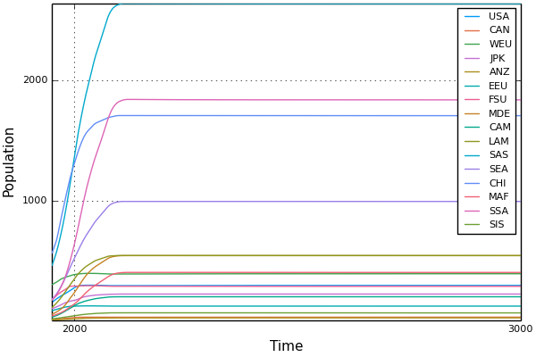

# User Guide

## Overview

See the Tutorial for in depth examples of one-region and multi-region models.

Any Mimi model is made up of at least one component, so before you define a model, you need to create your components. We define a component in the following way:

```julia
using Mimi

@defcomp MyComponent begin
  A = Variable(index = [time])
  B = Variable(index = [time])
  c = Parameter()
  d = Parameter(index = [time])
  e = Parameter(index = [time])
end
```


## Plotting



Mimi provides support for plotting using the [Plots](https://github.com/tbreloff/Plots.jl) module. Mimi extends Plots by adding an additional method to the `Plots.plot` function. Specifically, it adds a new method with the signature

```julia
function Plots.plot(m::Model, component::Symbol, parameter::Symbol ; index::Symbol, legend::Symbol, x_label::String, y_label::String)
```
A few important things to note:

- The model `m` must be built and run before it is passed into `plot`
- `index`, `legend`, `x_label`, and `y_label` are optional keyword arguments. If no values are provided, the plot will index by `time` and use the data it has to best fill in the axis labels.
- `legend` should be a `Symbol` that refers to an index on the model set by a call to `setindex`

This method returns a ``Plots.Plot`` object, so calling it in an instance of an IJulia Notebook will display the plot. Because this method is defined on the Plots package, it is easy to use the other features of the Plots package. For example, calling `savefig("x")` will save the plot as `x.png`, etc. See the [Plots Documentaton](https://juliaplots.github.io/) for a full list of capabilities.
